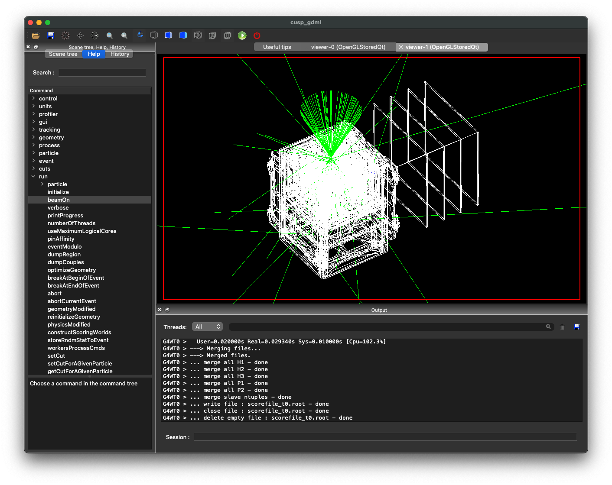

# g4cusp-gps

__A GEANT4 code to simulate the CUSP detector__

*Source Model: General Purpose Source (GPS)*



## Usage

Interactive mode:
`./cusp`

Batch mode:
`./cusp batch.mac`

## License
```txt
This code is released under MIT licence. Please, read the `LICENCE` file in the root dir. 
The copyright notice shall be included in all copies or substantial portions of the Software.


This code is under developement and the usage requires a basic understanding of how 
GEANT4 works. 

Please, if you use this code contact me for additional informations and support. 
E-mail: giovanni.decesare at inaf.it
```


